# EMG Gesture Recognition: Baseline Model Development and Sensor Rotation Analysis

## Objective
Train a baseline model to predict gestures within a single patient.

## Research Hypotheses
There are two key hypotheses in the gesture prediction task:
1. Transfer of model knowledge from one subject to another is poor.
2. When sensors are shifted (whether within a single recording session or during a repeated session), prediction accuracy decreases.

At this stage of the study, we will test the first hypothesis. Before shifting the sensors, it is necessary to first train a reference model in order to use its results for further comparison.

## Data Analysis and Structure
Before training the model, it is necessary to first look at the data and how it is structured. We will use Ninapro db2 as a dataset, namely a set of 3 gestures. The studied set contains 10 unique gestures (including resting). According to the dataset description, the data was recorded in a single session, with one gesture repeated six times, and a rest of equal duration between each gesture.

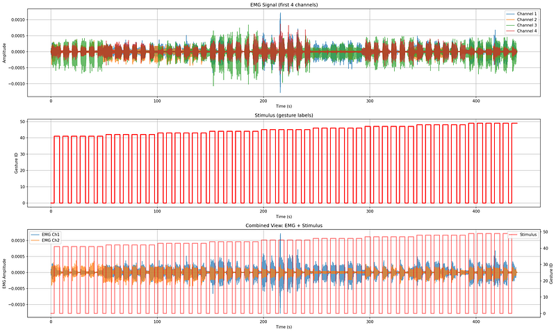

**Data Loading Implementation:**
```python
class NinaProLoader:
    def load_mat_file(self, file_path: Path) -> Dict:
        self.logger.info(f"Load file: {file_path}")
        try:
            data = sio.loadmat(str(file_path))
            return data
        except Exception as e:
            self.logger.error(f"Error during file loading {file_path}: {e}")
            raise
```

This question raises the question of how the researchers labeled the dataset and how to combat human inertia (reaction time). The answer is simple: no way.

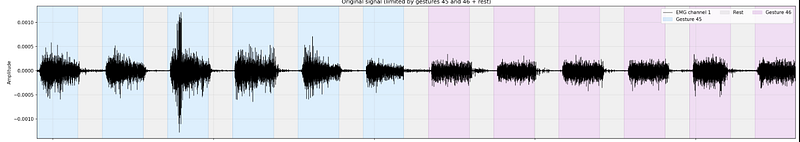

Looking at the visualization you can see that some gesture windows overlap the rest periods, while other times the target action overlaps the rest periods. Let's mark this problem with an asterisk and come back to it a little later, because at this stage it doesn't really bother us, and here's why.

## Preprocessing Pipeline

### Signal Segmentation
After we've analyzed the dataset, we need to understand how we'll preprocess it before feeding it into the model. First, we split the continuous signal into gestures (using the existing markup).

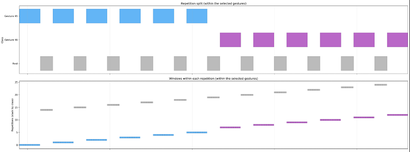

**Segmentation Implementation:**
```python
class GestureSegmenter:
    def segment_by_gestures(self, emg: np.ndarray, stimulus: np.ndarray, include_rest: bool = True) -> Dict[int, List[np.ndarray]]:
        stimulus = stimulus.flatten()
        stimulus_diff = np.diff(stimulus, prepend=0)
        gesture_changes = np.where(stimulus_diff != 0)[0]
        
        segments = {}
        for i in range(len(gesture_changes) - 1):
            start_idx = gesture_changes[i]
            end_idx = gesture_changes[i + 1]
            gesture_id = int(stimulus[start_idx])
            # ... segmentation logic
```

### Window Extraction
After we've grouped the signal by gestures, we need to split it into windows because the raw gesture segments are too long to feed into the neural network. When splitting the windows at this stage, we adhered to the following points:

**Window Configuration:**
```python
@dataclass
class ProcessingConfig:
    window_size: int = 500  # 250 ms at 2000 Hz
    window_overlap: int = 0
    sampling_rate: int = 2000
```

**Window size (500 samples):** Corresponds to 250 ms at a sampling frequency of 2000 Hz - you can set a different value, BUT here we'll remember the asterisk we added earlier.

**Window Extraction Implementation:**
```python
class WindowExtractor:
    def extract_windows(self, segment: np.ndarray) -> np.ndarray:
        num_samples = segment.shape[0]
        step = self.config.window_size - self.config.window_overlap
        num_windows = (num_samples - self.config.window_size) // step + 1
        # ... window extraction logic
```

We remember that the current markup allows for some error when a person starts resting between gestures too early or finishes a gesture late. Therefore, if you make the window size too small, false events will be included in the labeling. For example, a window will be labeled as resting, but in fact, the person was still performing a gesture. In general, this problem is worth testing experimentally; we'll do that another time.

### Dataset Splitting Strategy
Next comes an important step: dividing the windows into training and test samples.

When working with time series, never mix the resulting samples; this will lead to data leakage (especially if the samples overlap).

**Split Configuration:**
```python
@dataclass
class SplitConfig:
    train_ratio: float = 0.7
    val_ratio: float = 0.15
    test_ratio: float = 0.15
    mode: str = "by_segments"  # or "by_windows"
    shuffle_segments: bool = True
    include_rest_in_splits: bool = False
```

Now that we've learned this, does that mean we simply take samples from each gesture and sequentially split them into samples within each gesture? This is a good option, but there are some minor issues.

When we split the signal of a single gesture repetition into different samples, we allow so-called soft data leakage, because the signal within a single recording session will have its own characteristics that identify the sample specifically for that gesture repetition.

**Segment-based Splitting Implementation:**
```python
class DatasetSplitter:
    def _split_by_segments(self, grouped_windows: Dict[int, List[np.ndarray]]):
        for gid, seg_list in grouped_windows.items():
            n_seg = len(seg_list)
            idxs = np.arange(n_seg)
            if self.cfg.shuffle_segments:
                self.rng.shuffle(idxs)
            
            n_train = int(np.floor(n_seg * self.cfg.train_ratio))
            n_val = int(np.floor(n_seg * self.cfg.val_ratio))
            n_test = n_seg - n_train - n_val
            # ... assign entire segments to splits
```

For example, we have three sequences of the same gesture recorded during a single session, and during one of the recordings, the patient clenches his fist slightly tighter (for example). Then, it turns out that one of the three recordings of the same class will stand out from the others. When we split this characteristic sequence into training and test sets, it turns out that we will include in the test samples that will be related to the target class not by the characteristic features of the class, but by the characteristic features of the gesture repetition (strong compression), and then the model's assessment may be unfair.

This is not a huge problem, but it is better to avoid it and make the assessment more fair, namely, use some repetitions in their entirety as a test data set, and others as training.

This partitioning strategy reflects a real-world scenario when the model encounters completely new gesture executions, and not fragments of those already seen.
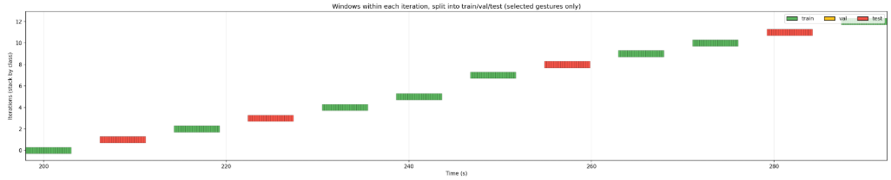

### Data Standardization
The next important step in preparing any data before feeding it to the model is standardization and/or normalization of the data. But what exactly needs to be chosen in a task related to EMG signals?

In short - standardization and here's why:

We are dealing with a multi-channel signal, which entails different intensities of each of the signals. Moreover, different intensity may be different over time for several reasons:

- For different gestures, different channels will produce different activity (for example, for gesture "A", the most active channel is 3, and for gesture "B", the most active channel is 4)
- Muscle fatigue within one recording session
- Electrode shift
- Change in skin impedance (for example, during sweating)

**Resistance to spikes:**
- Electrode movement
- Electrostatic discharges
- Sudden muscle spasms
- Equipment interference

**Standardization Implementation:**
```python
class WindowClassifierTrainer:
    def _compute_channel_standardization(self, X_train: np.ndarray) -> Tuple[np.ndarray, np.ndarray]:
        Xc = np.transpose(X_train, (0, 2, 1))  # (N, C, T)
        mean = Xc.mean(axis=(0, 2))
        std = Xc.std(axis=(0, 2)) + 1e-8
        return mean.astype(np.float32), std.astype(np.float32)
```

**Key aspects in standardization:**
- Calculating statistics only on training data (Prevents data leakage)
- Individual standardization for each channel (takes into account the different sensitivity of the electrodes)
- Standardization is needed to stabilize the training process and accelerate the convergence of gradient methods

## Model Architecture and Training
That's it, now our data is ready to be used to train a model. There are many architectures that perform well on a similar range of tasks, but we will start with the simplest one we'll stick to the principles of avoiding over-engineering, keeping things simple (Occam's razor), and not using a sledgehammer to crack a nut.

**Simple CNN Architecture:**
```python
class SimpleCNN1D(nn.Module):
    def __init__(self, in_channels: int, num_classes: int, dropout: float = 0.3):
        super().__init__()
        self.net = nn.Sequential(
            nn.Conv1d(in_channels, 32, kernel_size=5, padding=2),
            nn.BatchNorm1d(32),
            nn.ReLU(),
            nn.MaxPool1d(2),
            # ... more layers
            nn.Linear(128, num_classes),
        )
```

**Training Configuration:**
```python
@dataclass
class TrainingConfig:
    batch_size: int = 256
    epochs: int = 50
    learning_rate: float = 1e-3
    weight_decay: float = 1e-4
    dropout: float = 0.3
    early_stopping_patience: int = 7
    use_class_weights: bool = True
```

For training, a simple convolutional model was designed, implemented and tested. We conducted the following experiments:

1. Using 8 sensors (all sensors from the bracelet)

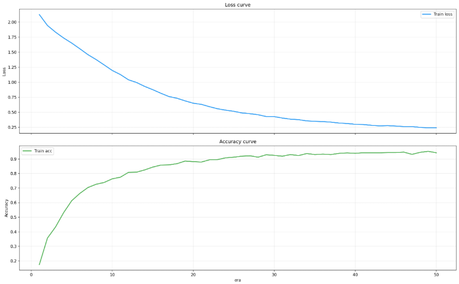
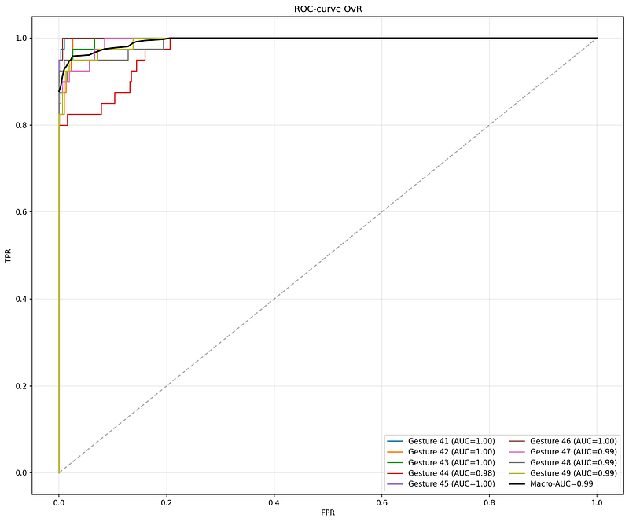
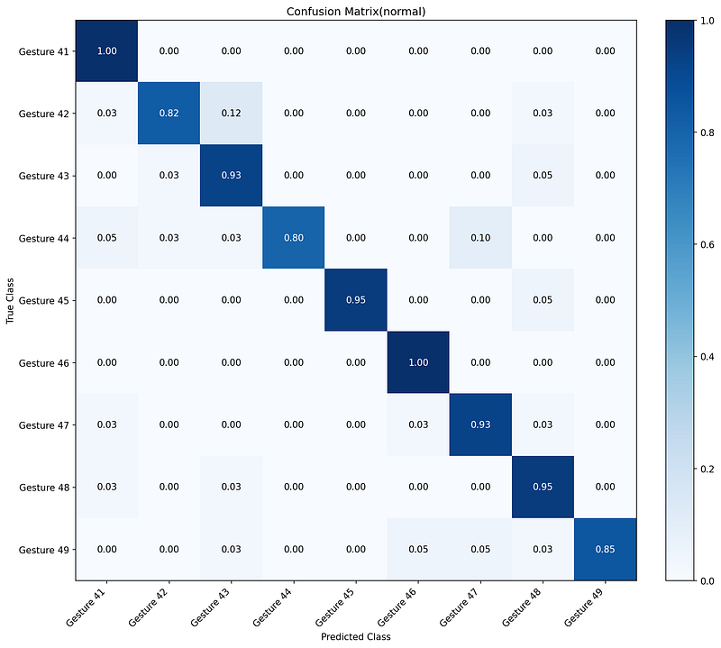

2. Using 4 sequential sensors

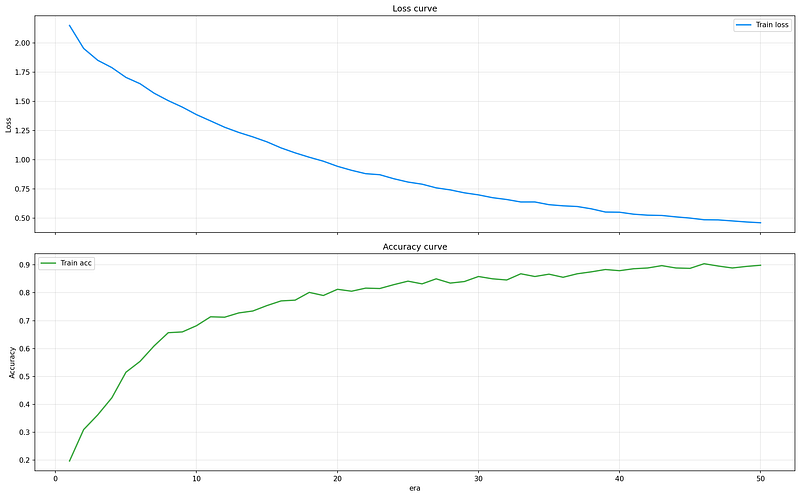
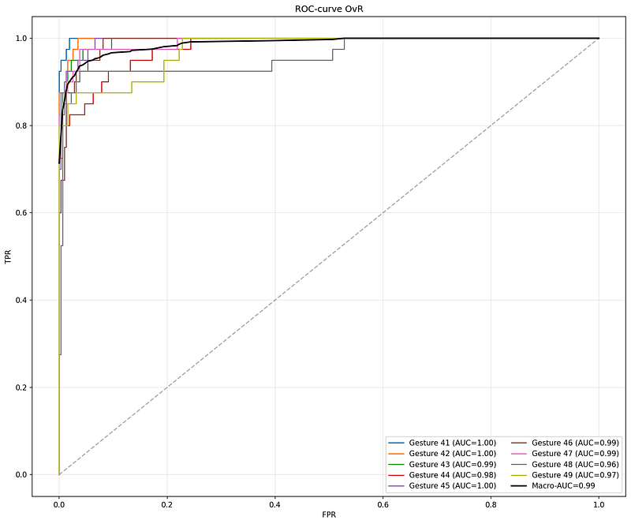
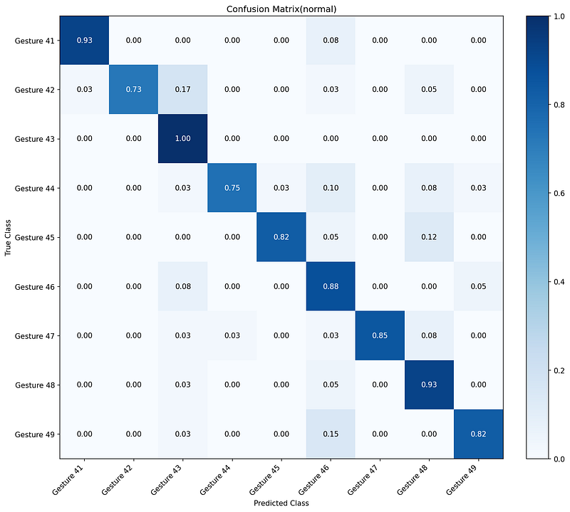

3. Using 4 sensors with a step of 1

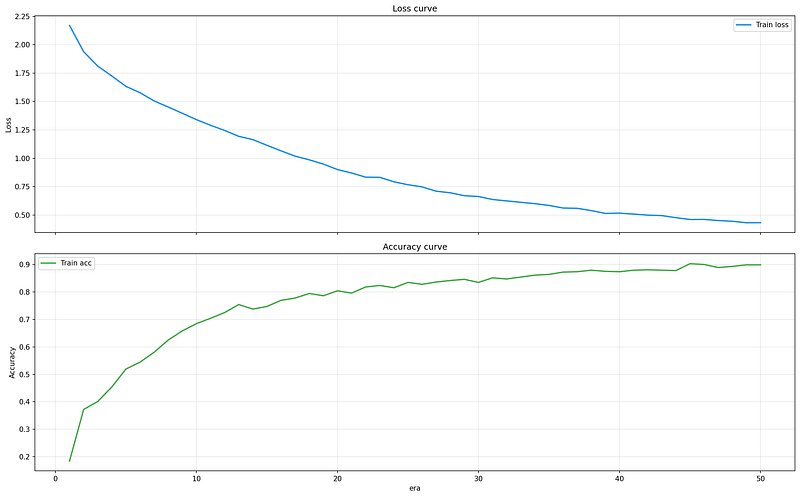
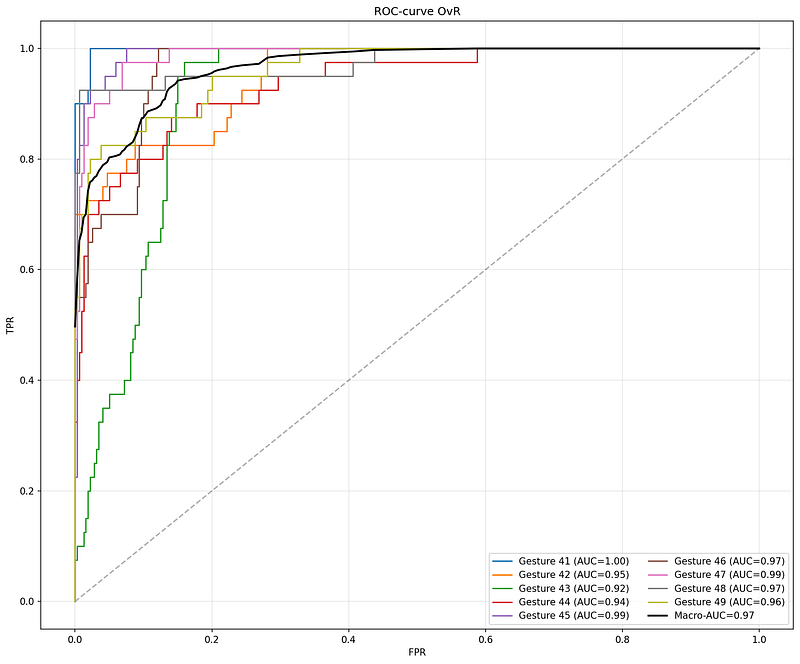
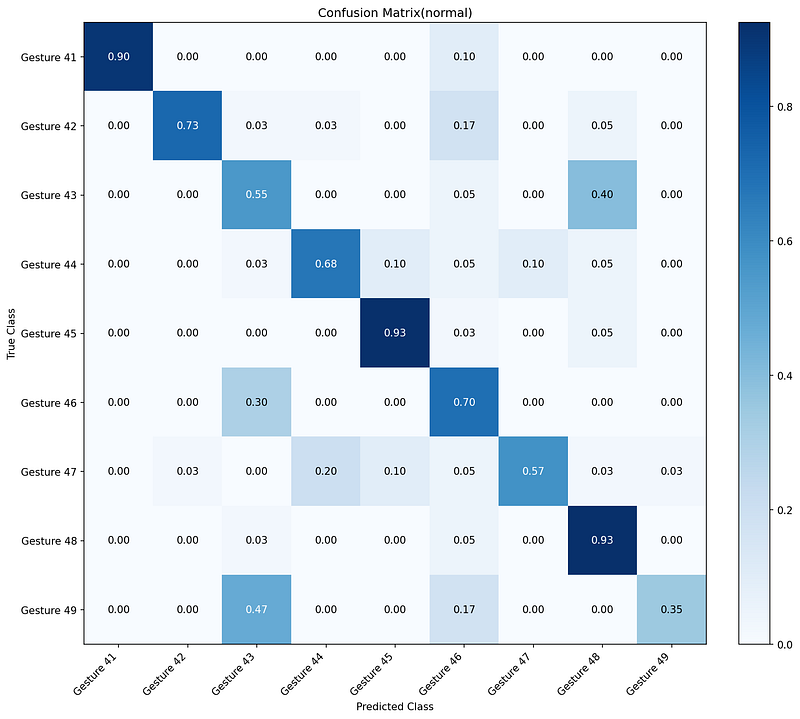

4. Using 2 sensors (several experiments with different combinations)

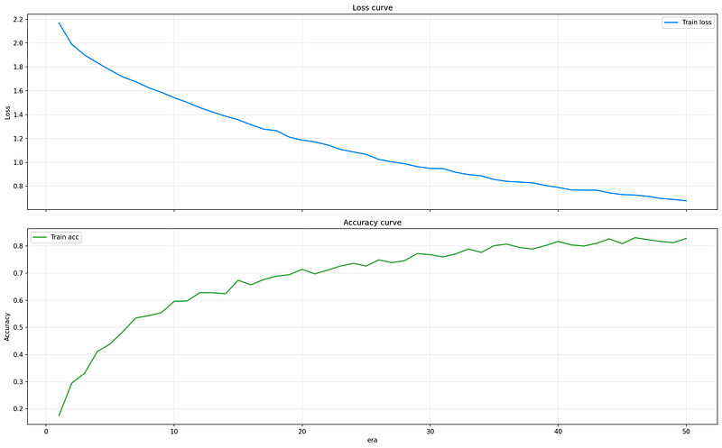
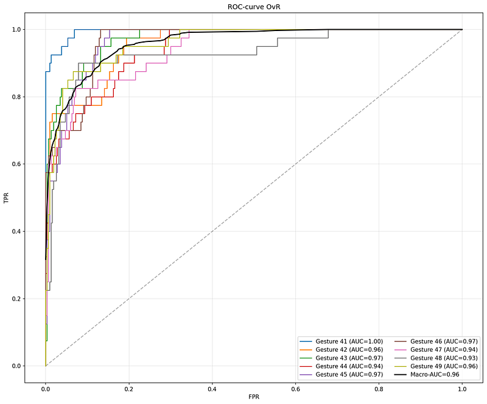
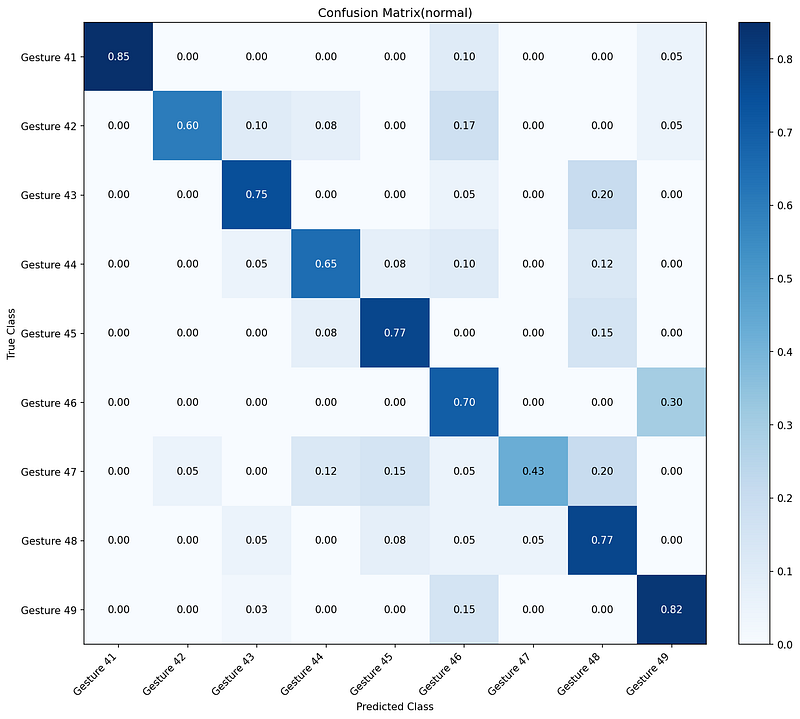

**Channel Selection Implementation:**
```python
class ProcessingConfig:
    def get_selected_channel_indices(self, total_channels: int, logger: Optional[logging.Logger] = None) -> List[int]:
        if self.channel_indices is not None:
            return sorted(set(i for i in self.channel_indices if 0 <= i < total_channels))
        if self.num_channels is not None:
            return list(range(min(self.num_channels, total_channels)))
        return list(range(total_channels))
```

## Experimental Results
Based on the experiments, we can conclude that within one subject (within a single recording session), we can predict with high accuracy what gesture he shows. Even when using only 2 sensors, the quality is quite high (provided that a fairly simple model is used).

## Hypothesis Testing: Sensor Rotation Impact
But let's go back to the original hypothesis:
When the sensors are shifted (whether within a single recording session or during a repeated session), the prediction accuracy decreases.

Since our dataset does not include information about the sensor positions, and especially since no recording sessions were conducted with controlled shifts, we will make a rough imitation of the shift.

**Rotation Experiment Configuration:**
```python
@dataclass
class RotationConfig:
    rotations: List[int]                 # e.g. [-3,-2,-1,0,1,2,3]
    bracelet_size: Optional[int] = None  # default == number of channels C
    channel_order: Optional[List[int]] = None  # mapping input-channel-index -> bracelet position
```

Let me remind you that we have 8 sensors located in the bracelet at an equal distance (in a circle). That is, if we simply shift the indices in the recorded signal, we simulate a rotation of the bracelet by the distance of 1 sensor. In other words, we make a false shift of the bracelet so that sensor 0 becomes 1, 1 -> 2 … n -> n+1.

**Rotation Implementation:**
```python
def build_rotation_permutation(C: int, shift: int, bracelet_size: Optional[int] = None, 
                              channel_order: Optional[List[int]] = None) -> np.ndarray:
    if bracelet_size is None:
        bracelet_size = C
    if channel_order is None:
        channel_order = list(range(C))
    
    perm = np.zeros(C, dtype=np.int64)
    for i in range(C):
        pos_i = channel_order[i]
        src_pos = (pos_i + shift) % bracelet_size
        # ... permutation logic
```

And the moment of truth, we try to predict gestures on the shifted dataset and get the following results.

**Rotation Evaluation:**
```python
class RotationExperiment:
    def evaluate_full_test_with_rotations(self, splits: Dict[str, Dict[int, np.ndarray]]) -> Dict[int, Dict]:
        rotation_to_metrics = {}
        for r in self.cfg.rotations:
            perm = build_rotation_permutation(C=C, shift=r, bracelet_size=bracelet_size,
                                            channel_order=ch_order, logger=self.logger)
            X_rot = apply_channel_permutation(X_test, perm)
            m = self.trainer.evaluate_numpy(X_rot, y_test, split_name=f"test_rot{r}", visualize=False)
            rotation_to_metrics[r] = m
```
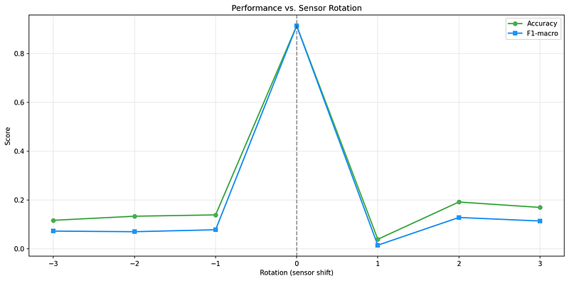
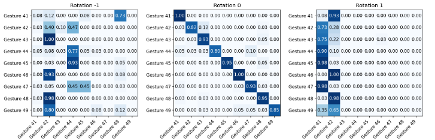

As we can see, the accuracy dropped exponentially, provided that we used all data sets. Thus, we confirmed the hypothesis.

## Next Steps
And in the next experiment, we will investigate the second hypothesis.